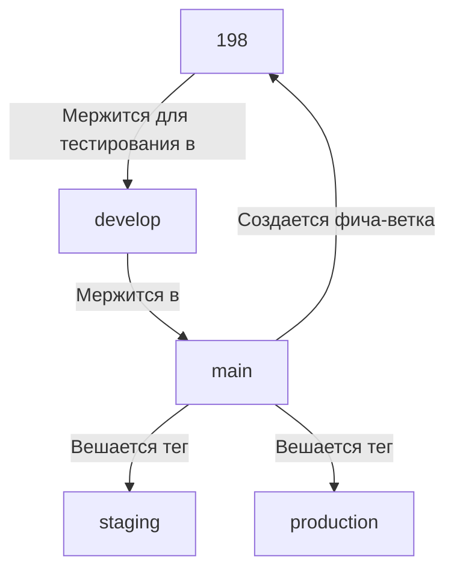
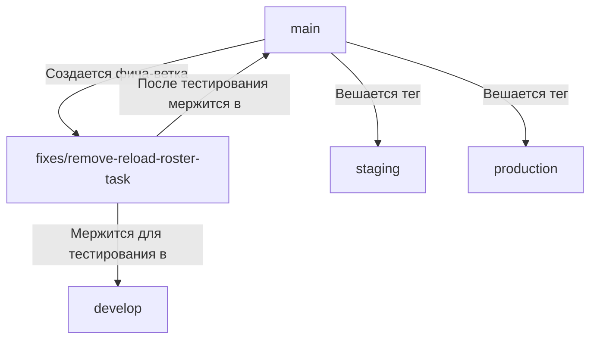

# Правила формирования веток

1. Все фича-ветки начинаются от ветки `main`.
2. Для тестирования все ветки мержатся в `develop`, через MR.
   > Чекбокс _Удалите исходную ветку, когда запрос на слияние принят или Delete source branch when merge request is accepted_, нажимать не надо.
3. Код для выкатки на `staging, production` собирается в ветку `main`.
4. Наименование веток:
   1. Обычные ветки `feature/[taskId]-[description-task]`.
   2. Hot-fix ветки: `fixes/[description-fix]`.
   3. Refactor ветки: `refactor/[taskId]-[description-task]`.
5. Теги `staging, production` вешаются только на ветку `main`.
6. Перед тем как мержить фиче-ветку в develop, необходимо выполнить squash коммитов в ней (особенно, если там много "мусорных" коммитов с названиями типа: "fixes", "fix typo" и т. д.).

#### Подробнее про наименование:

##### 4.1. Коммиты

`[taskId] [description]`

- `[taskId]` – номер задачи
- `[description]` – описание коммита своими словами, либо заголовок задачи

##### Результат:

`909 add status 'on_verification'`

или 

`909 Back. Добавление нового статуса "На верификации"`

##### 4.2. Обычные ветки

`feature/[taskId]-[description-task]`

##### Параметры:

- `[taskId]` - https://lms.educhain.ru/courses/134/assignments/198 - taksId=198
- `[description-task]` - add-tab-all (параметр необязателен для заполнения)

##### Результат:

`feature/198-add-tab-all` или `feature/198`

##### Схема работы:

---

##### 4.3. Hot-fix ветки

`fixes/[description-fix]`

##### 4.4. Refactor ветки

`refactor/[taskId]-[description-task]`

##### Параметры:

- `fixes` - обязательный параметр
- `[description-fix]` - обязательный параметр, описывает суть фикса

##### Результат:

`fixes/remove-reload-roster-task`

##### Схема работы:

---
